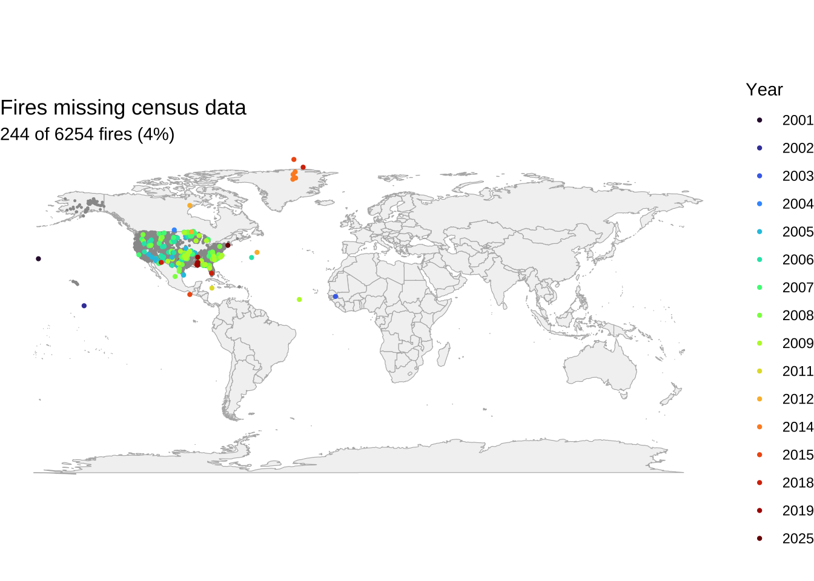
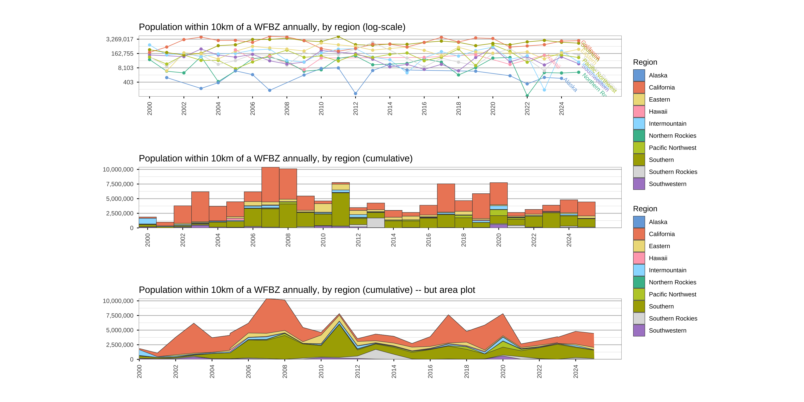
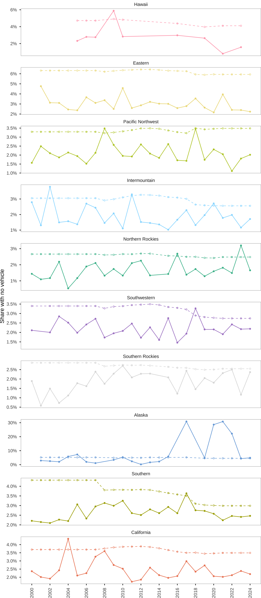
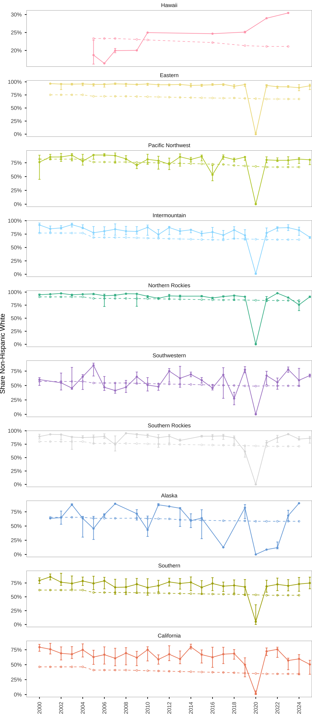
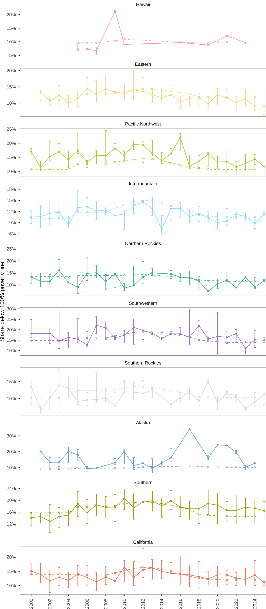
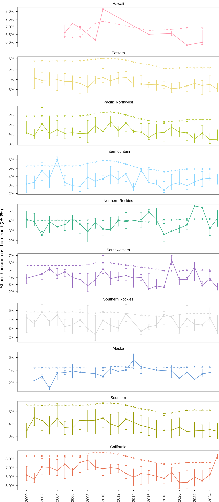
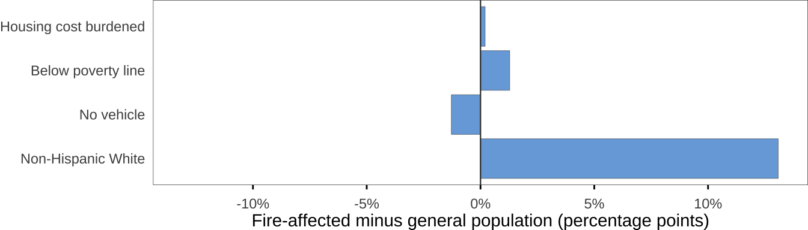
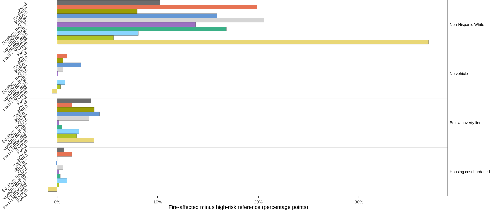
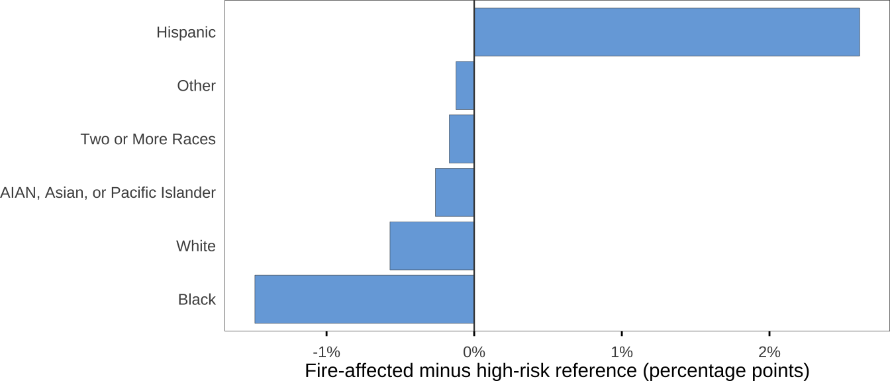

::: {.cell}

:::

::: {.cell}

:::

::: {.cell}

:::

::: {.cell}

:::

::: {.cell}

:::

::: {.cell}

:::

::: {.cell}
::: {.cell-output-display}

|variable      | n_wildfires|frac_sum_ok | n_all_zero| frac_min| frac_max|count_agree |
|:-------------|-----------:|:-----------|----------:|--------:|--------:|:-----------|
|race          |        6010|TRUE        |          0|        1|        1|TRUE        |
|poverty       |        6010|TRUE        |          0|        1|        1|TRUE        |
|vehicle_avail |        6140|TRUE        |          1|        1|        1|TRUE        |
|housing_cost  |        6140|TRUE        |          1|        1|        1|TRUE        |

:::
:::

::: {.cell}
::: {.cell-output-display}
{width=672}
:::
:::

::: {.cell}

:::

::: {.cell}

:::

## Pop over time

::: {.cell}
::: {.cell-output-display}
{width=1536}
:::
:::

## Vehicle Availability

::: {.cell}
::: {.cell-output-display}
{width=672}
:::
:::

## Race

::: {.cell}
::: {.cell-output-display}
{width=672}
:::
:::

## Poverty

::: {.cell}
::: {.cell-output-display}
{width=672}
:::
:::

## Housing Cost Burden

::: {.cell}
::: {.cell-output-display}
{width=672}
:::
:::

## Diverging Charts

::: {.cell}

:::

::: {.cell}

:::

### Overall

::: {.cell}
::: {.cell-output-display}
{width=672}
:::
:::

### By Region

::: {.cell}
::: {.cell-output-display}
{width=1344}
:::
:::

### Race Breakdown

::: {.cell}
::: {.cell-output-display}
{width=672}
:::
:::

